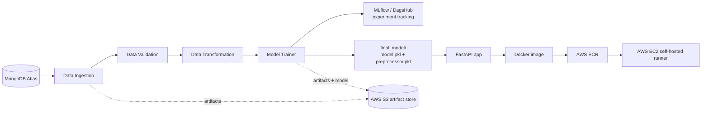

# 🛡️ Network Security — Phishing Website Detection

An end-to-end machine learning pipeline that pulls network/URL-based features from MongoDB, validates and transforms the data, trains a phishing-classification model, tracks experiments with MLflow, and serves predictions through a FastAPI service. The project is containerized with Docker and deployed to AWS through a GitHub Actions CI/CD pipeline.

## Table of Contents
- [Overview](#overview)
- [Architecture](#architecture)
- [Pipeline Stages](#pipeline-stages)
- [Tech Stack](#tech-stack)
- [Project Structure](#project-structure)
- [Setup](#setup)
- [Usage](#usage)
- [Experiment Tracking](#experiment-tracking)
- [Docker](#docker)
- [CI/CD (GitHub Actions → AWS)](#cicd-github-actions--aws)
- [Security Notes](#security-notes)
- [Dataset](#dataset)
- [Roadmap](#roadmap)
- [License](#license)

## Overview

Phishing websites imitate legitimate ones to trick users into giving up sensitive information. This project trains a supervised classifier that predicts whether a site is phishing (`Result` target column) from 30 URL/domain/HTML-derived features — `having_IP_Address`, `SSLfinal_State`, `age_of_domain`, `web_traffic`, and so on — based on the classic UCI Phishing Websites dataset.

The code follows a modular, production-style ML pipeline (**config → component → artifact**) commonly used in MLOps projects: every stage reads a `*Config` object, does its work, and writes an immutable, timestamped `*Artifact` that the next stage consumes, so no run overwrites another.

## Architecture



## Pipeline Stages

1. **Data Ingestion** — reads the raw records from the MongoDB `NetworkData` collection, exports them to the feature store as CSV, drops the Mongo `_id` column, and splits the data into train/test (80/20) under `Artifacts/<timestamp>/data_ingestion/ingested/`.

2. **Data Validation** — checks the number of columns and presence of numerical columns against `data_schema/schema.yaml` (30 features + `Result` target), and detects data drift between train and test distributions using the Kolmogorov–Smirnov test (`scipy.stats.ks_2samp`). Writes a `report.yaml` drift report and routes data to `valid/` or `invalid/`.

3. **Data Transformation** — imputes missing values with a `KNNImputer` (`n_neighbors=3`) wrapped in a scikit-learn `Pipeline`, saves the fitted preprocessing object (`preprocessing.pkl`), and writes `train.npy` / `test.npy`.

4. **Model Training** — trains and compares Random Forest, Decision Tree, Gradient Boosting, Logistic Regression, and AdaBoost with `GridSearchCV`, selects the best model against the expected accuracy threshold (`MODEL_TRAINER_EXPECTED_SCORE = 0.6`), logs F1/precision/recall to MLflow (tracked on DagsHub), and saves the winning model + preprocessor (bundled as a `NetworkModel`) to `final_model/`.

5. **Sync to S3** — both the run's `Artifacts/` folder and `final_model/` are synced to the configured S3 bucket (`TRAINING_BUCKET_NAME`) after training completes.

> **Note:** the design sketches for this project also include **Model Evaluation** (accept/reject a newly trained model against the currently deployed one) and **Model Pusher** components. These aren't implemented in code yet — see [Roadmap](#roadmap).

## Tech Stack

| Layer | Tools |
|---|---|
| Language | Python 3.10 |
| ML | scikit-learn, pandas, NumPy |
| Experiment tracking | MLflow + DagsHub |
| Database | MongoDB Atlas |
| API | FastAPI + Uvicorn |
| Containerization | Docker |
| Cloud | AWS S3, ECR, EC2 (self-hosted runner) |
| CI/CD | GitHub Actions |

## Project Structure

```
networksecurity/
├── .github/workflows/main.yml         # CI/CD: build → push to ECR → deploy on EC2
├── Network_Data/phisingData.csv       # Raw dataset
├── data_schema/schema.yaml            # Expected columns & dtypes
├── networksecurity/
│   ├── cloud/s3_syncer.py             # Sync artifacts/model to S3
│   ├── components/
│   │   ├── data_ingestion.py
│   │   ├── data_validation.py
│   │   ├── data_transformation.py
│   │   └── model_trainer.py
│   ├── constant/training_pipeline/__init__.py  # All pipeline constants
│   ├── entity/
│   │   ├── config_entity.py           # *Config classes for every stage
│   │   └── artifact_entity.py         # *Artifact classes for every stage
│   ├── exception/exception.py         # Custom exception with file/line info
│   ├── logging/logger.py              # Timestamped log files under logs/
│   ├── pipeline/
│   │   ├── training_pipeline.py       # Orchestrates all stages end to end
│   │   └── batch_prediction.py        # Placeholder, not yet implemented
│   └── utils/
│       ├── main_utils/utils.py        # save/load object & numpy array helpers
│       └── ml_utils/
│           ├── metric/classification_metric.py
│           └── model/estimator.py     # NetworkModel wrapper (preprocessor + model)
├── final_model/                       # model.pkl + preprocessor.pkl used by the API
├── templates/table.html               # Prediction results view
├── app.py                             # FastAPI app (/train, /predict)
├── main.py                            # Run the training pipeline directly
├── push_data.py                       # One-off script: CSV → MongoDB
├── test_mongodb.py                    # Quick MongoDB connectivity check
├── Dockerfile
├── requirements.txt
└── setup.py
```

## Setup

### Prerequisites
- Python 3.10
- A MongoDB Atlas cluster (or local MongoDB instance)
- AWS account with an S3 bucket, if you want artifact/model syncing
- (Optional) DagsHub account for MLflow experiment tracking

### 1. Clone and install

```bash
git clone <your-repo-url>
cd networksecurity
python -m venv venv
source venv/bin/activate      # venv\Scripts\activate on Windows
pip install -r requirements.txt
```

### 2. Configure environment variables

Create a `.env` file in the project root:

```env
MONGO_DB_URL=mongodb+srv://<username>:<password>@<cluster-url>/?retryWrites=true&w=majority
MONGODB_URL_KEY=mongodb+srv://<username>:<password>@<cluster-url>/?retryWrites=true&w=majority
```

> `push_data.py` reads `MONGO_DB_URL` while `app.py` reads `MONGODB_URL_KEY` — set both to the same connection string, or standardize on one variable name across both files.

For S3 syncing, configure AWS credentials locally via `aws configure` or the standard `AWS_ACCESS_KEY_ID` / `AWS_SECRET_ACCESS_KEY` / `AWS_REGION` environment variables.

### 3. Load the dataset into MongoDB

```bash
python push_data.py
```

This reads `Network_Data/phisingData.csv` and inserts it into the `KRISHAI.NetworkData` collection.

## Usage

### Run the training pipeline directly

```bash
python main.py
```

### Start the API

```bash
python app.py
# or
uvicorn app:app --host 0.0.0.0 --port 8000 --reload
```

Visit `http://localhost:8000/docs` for interactive Swagger docs.

| Endpoint | Method | Description |
|---|---|---|
| `/` | GET | Redirects to `/docs` |
| `/train` | GET | Runs the full training pipeline |
| `/predict` | POST | Upload a CSV, get predictions rendered as an HTML table (also saved to `prediction_output/output.csv`) |

## Experiment Tracking

Each training run logs F1 score, precision, and recall to MLflow, tracked via DagsHub. Set these as environment variables rather than hardcoding them in source (see [Security Notes](#security-notes)):

```env
MLFLOW_TRACKING_URI=https://dagshub.com/<your-username>/<your-repo>.mlflow
MLFLOW_TRACKING_USERNAME=<your-dagshub-username>
MLFLOW_TRACKING_PASSWORD=<your-dagshub-token>
```

## Docker

```bash
docker build -t networksecurity .
docker run -d -p 8080:8080 --env-file .env networksecurity
```

## CI/CD (GitHub Actions → AWS)

Pushing to `main` triggers `.github/workflows/main.yml`:

1. **Continuous Integration** — checkout, lint, test (currently placeholder steps)
2. **Continuous Delivery** — build the Docker image and push it to AWS ECR
3. **Continuous Deployment** — a self-hosted runner on your EC2 instance pulls the image and runs it on port `8080`

Required GitHub repo secrets:

| Secret | Description |
|---|---|
| `AWS_ACCESS_KEY_ID` | IAM user access key |
| `AWS_SECRET_ACCESS_KEY` | IAM user secret key |
| `AWS_REGION` | e.g. `us-east-1` |
| `AWS_ECR_LOGIN_URI` | e.g. `<account-id>.dkr.ecr.<region>.amazonaws.com` |
| `ECR_REPOSITORY_NAME` | Your ECR repository name |

One-time EC2 setup for the self-hosted runner:

```bash
sudo apt-get update -y
sudo apt-get upgrade -y
curl -fsSL https://get.docker.com -o get-docker.sh
sudo sh get-docker.sh
sudo usermod -aG docker ubuntu
newgrp docker
```

## Security Notes

- Don't commit `.env` or credentials — add `.env` to `.gitignore`.
- `networksecurity/components/model_trainer.py` currently hardcodes a DagsHub/MLflow tracking username and access token. **Rotate that token and move it to environment variables** before making this repository public.
- `final_model/` and `Artifacts/` contain trained model binaries; consider excluding large artifacts from git and pulling them from S3 instead.

## Dataset

`Network_Data/phisingData.csv` — 30 URL/domain/HTML-based features (e.g. `having_IP_Address`, `Shortining_Service`, `SSLfinal_State`, `age_of_domain`, `web_traffic`) with a binary `Result` target (phishing vs. legitimate), based on the UCI Phishing Websites dataset.

## Roadmap

- [ ] Model Evaluation component — compare a newly trained model against the currently deployed one before accepting it
- [ ] Model Pusher component — push an accepted model to S3 / a model registry (shown in the architecture design but not yet built)
- [ ] Replace placeholder lint/test steps in CI with real linting and unit tests
- [ ] Implement `pipeline/batch_prediction.py`, currently empty
- [ ] Standardize the Mongo connection env var name between `push_data.py` and `app.py`

## License

No license is currently specified for this repository. Add one (e.g. MIT) if you plan to make it public.